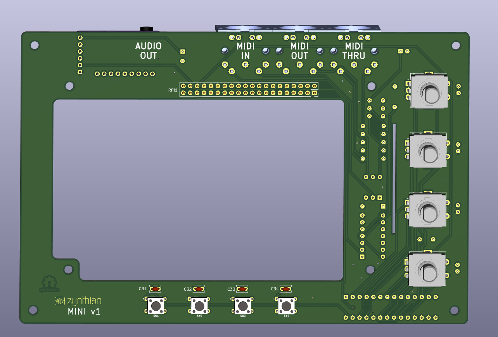

# zynthian-mini
Zynthian Mini is minimalistic approach to build zynthian synthesizer that should be cheap and easy to assemble but still covering most of zynthian synth capabilities including latest 5" screen.

This is not another professional build of a zyntnhian synth. If you are looking for that go to zynthi8an.org and purahcse one directly. This zynthian mini is lucking capabilities such as audio-in, TRS audio connectors, does not come with the best in class DAC for audio out, does not have rigid metal case neither it is fully tested tested .

Main features of this build are:
- include all encoders and switches that exist on V4 version
- include MIDI IN, OUT and THRU
- inlcude AUDIO OUT (PMC5102 DAC) using very afordable small PCB
- does not have cables apart form very short 40 ribbon cable that is used to connect to raspberry pi. What I have learned is that cables create too much possibilities for errors and random problems due to their poor connectivity when not professionally assembled
- does not need the case to start with
- most of connectors are easy to reach

This repo include KiCad project for design of the PCB (hardware-KicAD folder). Here are the PCB design images:

Here is a list of components requeried to assemble the synth:
- PCB as per design in hardware-KiCad folder
- C1: 470u 10V
- C2,C3,C5,C6:	100n
- C4: 100u
- D1: 1N4148
- 3	MIDI PCB mountable connectors
- R1,R3,R5,R4,R6: 220R
- R2: 1k
- H11L1M
- 74HCT14
- GY-PCM5102 I2S sound card
- C22,C16,C19,C13,C32,C34,C33,C31: 100n
- MCPMCP23017_SP1
- 40 pin header male (20x20)
- Enc2,Enc4,Enc1,Enc3: Rotary Encoder with a switch
- SW2,SW4,SW1,SW3	push-button	
- RPI 5" screen	
- 4 Encoder caps (12mm wide)
- short 40 pin ribbon cable for connecting the raspbvery pi
- raspberry pi 4

Here are some photos of assembled synth. Ignore some of the soldered yellow wires - they are there due to PCB design errors in regards of 4 bottom switches. These design errors are fixed.

